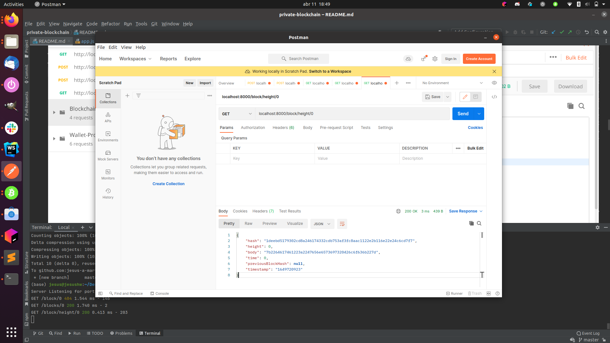
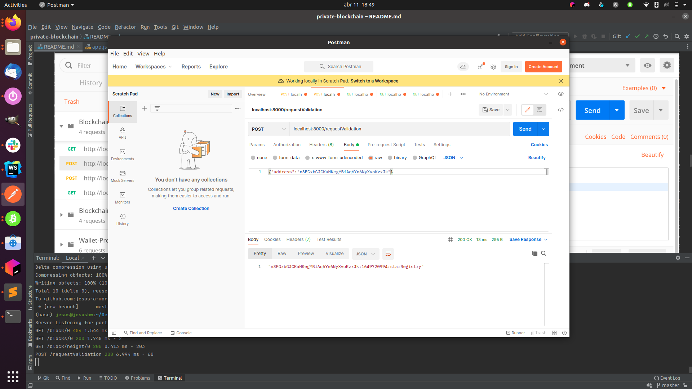
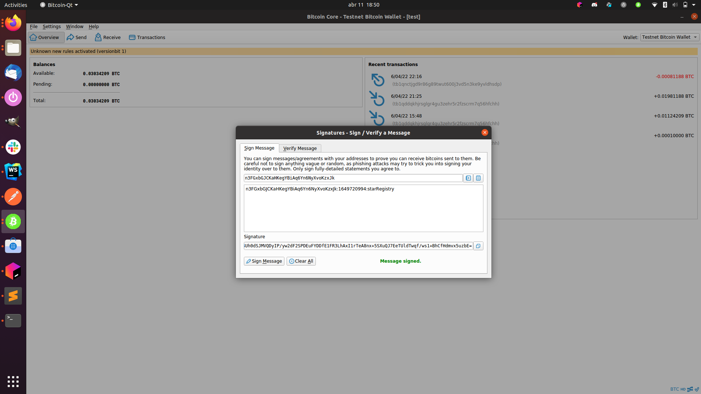
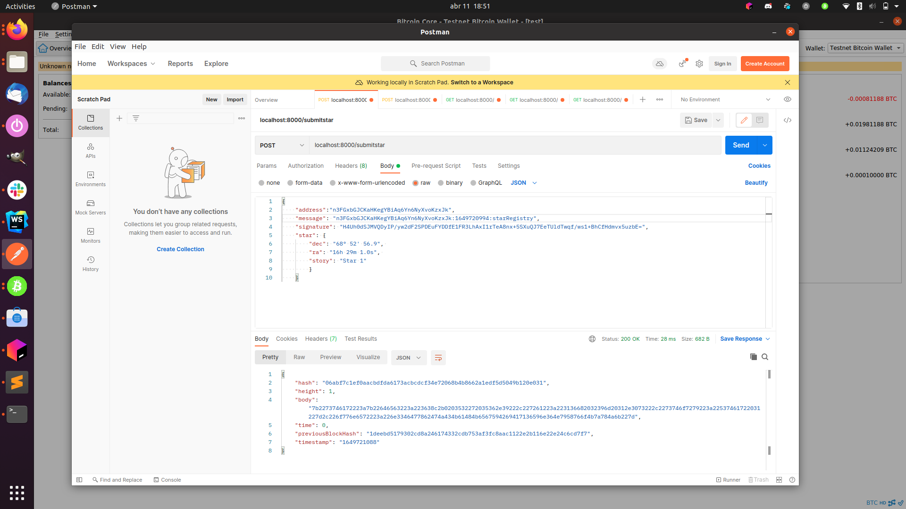
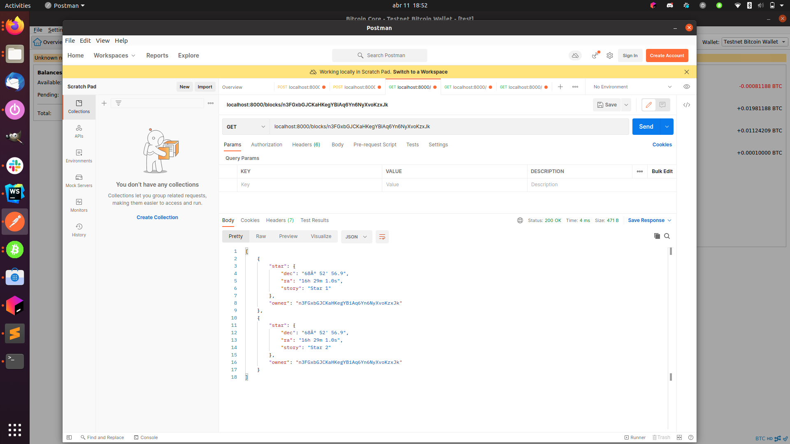
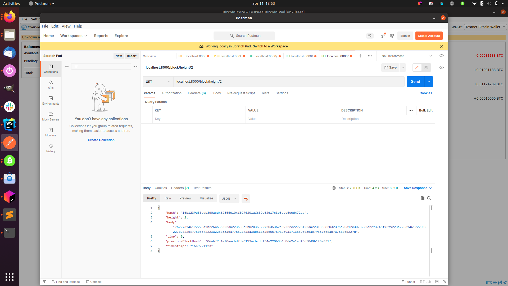

# Private Blockchain Application

The images attached below demonstrate the complete functionality of the project:

1. The server runs and we can fetch the genesis block:

2. Request validation:

3. Sign message:

4. Submit star:

5. Get all blocks by address:

6. Get block by height:

7. Get block by hash:

8. Validate chain:

